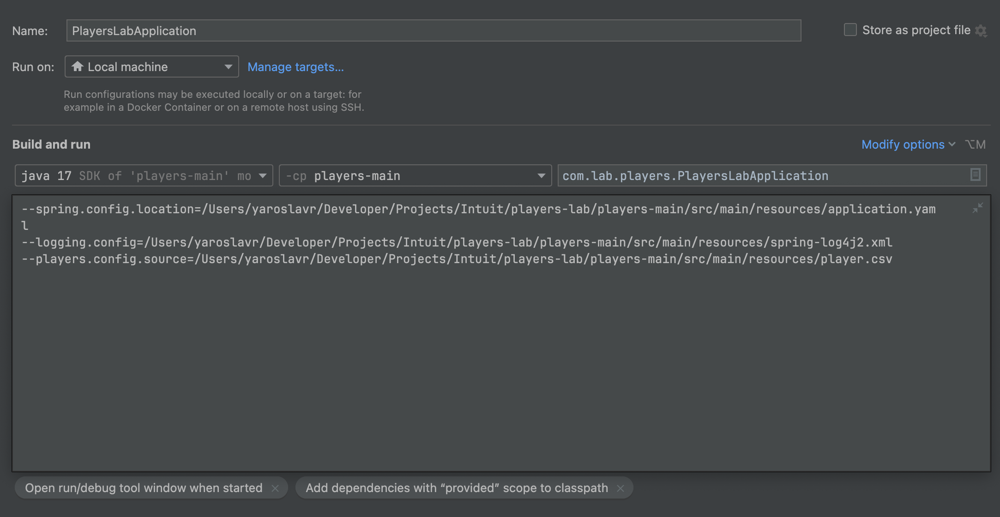
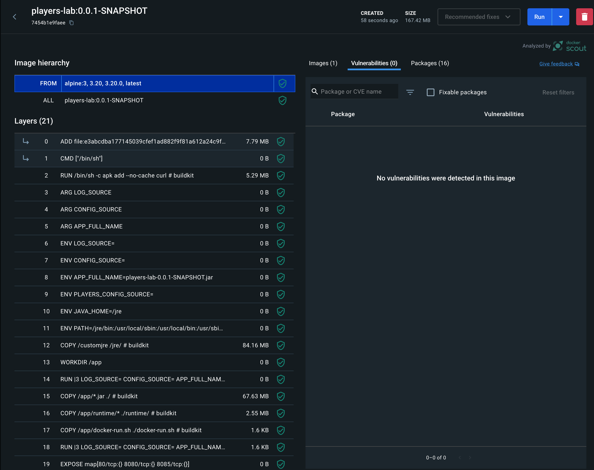
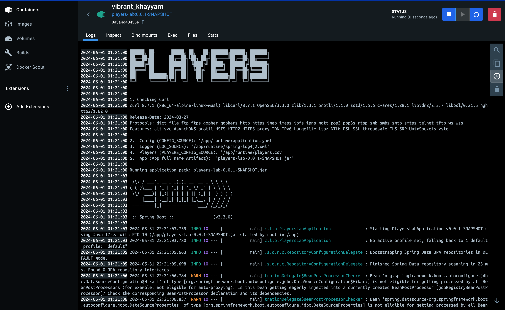
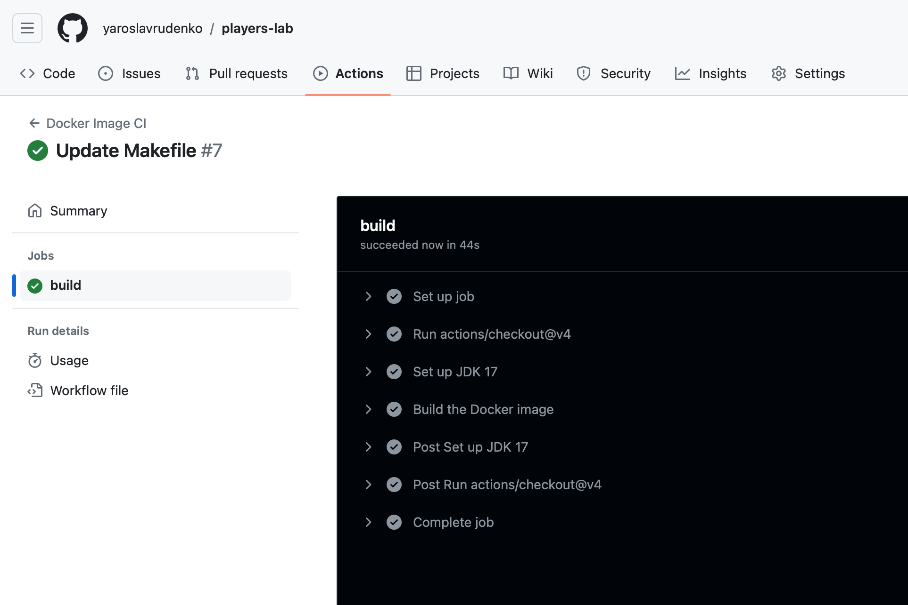

# Players Lab Project
Spring lab project with Java Enterprise Stack.  

### Overview
This project is a Spring Boot application designed to load player data from a CSV file into an H2 database and expose the data through three asynchronous endpoints using Spring WebFlux.  
The application reads the CSV file in chunks, processes each chunk asynchronously, and stores the data in the database for efficient and scalable performance.  

### Features
1. **CSV File Processing**: The application reads a `player.csv` file, which is split into small chunks (default size is 1MB). Each chunk is processed to convert the data into a list of Player objects.
2. **Asynchronous Data Loading**: The chunks are processed and loaded into the H2 database asynchronously to optimize performance and responsiveness.
3. **Reactive Endpoints**: The application uses Spring WebFlux to expose three endpoints that provide reactive, non-blocking access to the player data.
4. **Request Caching**: The application employs caching strategies to improve performance and reduce database load.
5. **Monitoring with Prometheus**: Application metrics are collected and exposed via Prometheus for monitoring.
6. **Logging with Log4j2**: The application uses Log4j2 for comprehensive and configurable logging.
7. **API Documentation with Swagger**: The application uses Swagger to provide interactive API documentation.
8. **H2 Console**: An embedded H2 database console is available for direct database access.

### Schema

```text
+--------------------+                     +------------------+
|  Players.csv File  |                     |   Spring Boot    |
|                    |                     |   Application    |
+--------------------+                     +------------------+
          |                                      |
          | (Read in chunks, 1MB default)        |
          V                                      |
+--------------------+                     +------------------+
|  CSV Chunk Reader  |                     |  Asynchronous    |
| (Process each chunk|                     |  Processing      |
|   to List<Player>) |                     |                  |
+--------------------+                     +------------------+
          |                                      |
          V                                      |
+--------------------+                     +------------------+
|  List<Player>      |    Asynchronously   |  H2 Database     |
|  (from each chunk) +-------------------> | (Save Players)   |
+--------------------+                     +------------------+
                                                      |
                                                      V
                                              +------------------+
                                              |  WebFlux API     |
                                              |  Endpoints       |
                                              +------------------+
                                                      |
                                                      V
                                              +------------------+
                                              |  API Consumer    |
                                              |  (e.g., Swagger) |
                                              +------------------+

```

### Endpoints
Retrieves a paginated and sorted list of players. The response is in JSON format.
```
GET application/json /api/players?page=0&size=50&sort=birthYear,asc
```
Streams all player data in JSON streaming format.
```
GET application/stream+json /api/players/stream
```
Retrieves a specific player by their ID. The response is in JSON format.
```
GET application/stream+json /api/players/{playerID}
```

### CURL Commands to Read Data
Retrieve Paginated and Sorted List of Players:
```shell
curl -X GET "http://localhost:8080/api/players?page=0&size=50&sort=birthYear,asc" -H "Accept: application/json"
````

Stream All Player Data:
```shell
curl -X GET "http://localhost:8080/api/players/stream" -H "Accept: application/stream+json"
```

Retrieve Specific Player by ID:
```shell
curl -X GET "http://localhost:8080/api/players/{playerID}" -H "Accept: application/stream+json"
```

### Caching Requests
Caching is implemented to enhance performance and reduce the load on the database by storing frequently accessed data in memory.   
This can be achieved using Spring Cache with annotations like @Cacheable, @CachePut, and @CacheEvict.

### Monitoring with Prometheus, documenting with Swagger
Prometheus is used to collect and expose metrics from the application for monitoring purposes.   
Spring Boot Actuator provides out-of-the-box integration with Prometheus.

```yaml
management:
  endpoints:
    web:
      exposure:
        include: health,metrics,prometheus
  metrics:
    export:
      prometheus:
        enabled: true
```

Prometheus Endpoints:
```shell
curl http://localhost:8080/actuator/prometheus
```

Swagger is used to document and test the API endpoints. Springfox library is often used to integrate Swagger into Spring Boot applications.  

Swagger Enpoint:
```shell
http://localhost:8080/swagger-ui.html
```

### H2 Console
The H2 Console is enabled to allow direct access to the embedded H2 database.   
This is useful for development and debugging purposes.

```yaml
spring:
  h2:
    console:
      enabled: true
      path: /h2-console
  datasource:
    url: jdbc:h2:mem:testdb
    driverClassName: org.h2.Driver
    username: sa
    password: password
```

H2 Console URL:
```shell    
http://localhost:8080/h2-console
```


# Getting Started

For building and running the application you may need:
- [JDK 17](https://www.oracle.com/java/technologies/downloads/#java17)
- [Maven 3](https://maven.apache.org)
- [Docker](https://www.docker.com/)
- [Postman](https://www.postman.com/)
- [IntelliJ IDEA](https://www.jetbrains.com/idea/) Optional, command line script provided
- [Git](https://git-scm.com/)

### Build and run with CMD
To run application with command-line, need to execute following steps.   
Build a code:
```shell
make build
```

Run shell script, included in repository:
```shell
make run
```
or use ready script:
```shell
sh ./scripts/local-run.sh
```
or standard java FAT Jar command:
```shell
java $JAVA_OPTS -jar players-lab-0.0.1-SNAPSHOT.jar --spring.config.location=${CONFIG_FILE} --logging.config=${LOG_FILE} --players.config.source=${PLAYERS_CONFIG_SOURCE}
```
NOTE: Make sure, that ```local-run.sh``` configured properly with following variables: `CONFIG_FILE`, `LOG_FILE`, `PLAYERS_CONFIG_SOURCE` (need put custom configs)  
If these variables are not set, **application will use default configuration from resources**.

IntelliJ IDEA can be used to run application as well:  

[](./img/5.png)

### Build with Docker
To build Docker Image, there is `Makefile` provided to simplify process.   
To know all function, provided by Makefile, there is command `make help` need to be invoked.

```shell
make help                                                                                             
usage: make [target]

build                          - Compile and Build application
docker-build                   - Build Docker image for  application
docker-delete-containers       - Delete all docker stopped containers
docker-delete-image            - Delete  docker image
docker-delete-images           - Delete all docker unused images
docker-info                    - Docker Info about  docker image
docker-ls                      - List of docker images
docker-run                     - Run in Docker the  docker image
docker-scan                    - Scan for known vulnerabilities the  docker image
env                            - List of Env variables
help                           - Show help message
push-to-aws                    - Push docker image to AWS Elastic Container Registry
scan                           - Scan for known vulnerabilities the  docker image

```

Before build, following resources could be pre-configured or **application will use default configuration from resources**:  
**ATTENTION**: You can ignore this step, if you want to use default configuration from resources.
```shell
export CONFIG_SOURCE==/Users/some-path/players-lab/players-main/src/main/resources/application.yaml   
export LOG_SOURCE=/Users/some-path/players-lab/players-main/src/main/resources/spring-log4j2.xml
export PLAYERS_CONFIG_SOURCE=/Users/some-path/players-lab/players-main/src/main/resources/player.yaml
```
To build Docker image, following command must be used with `Makefile`:

1. Build a code:
```shell
make build
```
2. Start Docker build process:
```shell
make docker-build
```

3. Push Docker image to AWS Elastic Container Registry:
```shell
make push-to-aws
```

Docker image is build with multi-stage build, so it is optimized for production use.   
It is based on tiny Linux Alpine image, which is very small and secure (~6MB).  
Docker security check results for vulnerabilities:  

[](./img/2.png)

Running Docker image:

[](./img/1.png)

Building with GiFlow is also supported, so it is possible to use GitHub Actions for CI/CD:  

[](./img/3.png)

### Reference Documentation
For further reference, please consider the following sections:

* [Official Apache Maven documentation](https://maven.apache.org/guides/index.html)
* [Spring Boot Maven Plugin Reference Guide](https://docs.spring.io/spring-boot/docs/3.3.0/maven-plugin/reference/html/)
* [Create an OCI image](https://docs.spring.io/spring-boot/docs/3.3.0/maven-plugin/reference/html/#build-image)
* [Spring Web](https://docs.spring.io/spring-boot/docs/3.3.0/reference/htmlsingle/index.html#web)
* [Spring Reactive Web](https://docs.spring.io/spring-boot/docs/3.3.0/reference/htmlsingle/index.html#web.reactive)
* [Spring Security](https://docs.spring.io/spring-boot/docs/3.3.0/reference/htmlsingle/index.html#web.security)
* [Spring Data JPA](https://docs.spring.io/spring-boot/docs/3.3.0/reference/htmlsingle/index.html#data.sql.jpa-and-spring-data)
* [Spring Batch](https://docs.spring.io/spring-boot/docs/3.3.0/reference/htmlsingle/index.html#howto.batch)
* [Spring Boot Actuator](https://docs.spring.io/spring-boot/docs/3.3.0/reference/htmlsingle/index.html#actuator)
* [Prometheus](https://docs.spring.io/spring-boot/docs/3.3.0/reference/htmlsingle/index.html#actuator.metrics.export.prometheus)

### Guides
The following guides illustrate how to use some features concretely:

* [Building a RESTful Web Service](https://spring.io/guides/gs/rest-service/)
* [Serving Web Content with Spring MVC](https://spring.io/guides/gs/serving-web-content/)
* [Building REST services with Spring](https://spring.io/guides/tutorials/rest/)
* [Building a Reactive RESTful Web Service](https://spring.io/guides/gs/reactive-rest-service/)
* [Securing a Web Application](https://spring.io/guides/gs/securing-web/)
* [Spring Boot and OAuth2](https://spring.io/guides/tutorials/spring-boot-oauth2/)
* [Authenticating a User with LDAP](https://spring.io/guides/gs/authenticating-ldap/)
* [Accessing Data with JPA](https://spring.io/guides/gs/accessing-data-jpa/)
* [Creating a Batch Service](https://spring.io/guides/gs/batch-processing/)
* [Building a RESTful Web Service with Spring Boot Actuator](https://spring.io/guides/gs/actuator-service/)


